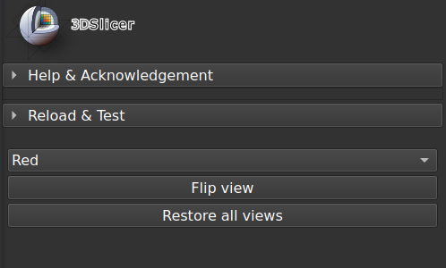

# FlipViewPoint module

This [Slicer](https://www.slicer.org/) module flips 2D viewpoints.

**Usage**

Click on a button to flip the respective view.

**Comments**

The view is rotated by 180°.

The Red view is used for reference. Its normal view direction is from bottom to top. We flip it here from top to bottom, and vice-versa.

When a 3D view is displayed from top to bottom by clicking the axis widget on the 'S' label, left and right are inversed with respect to the normal 2D view. Flipping the 2D view to the same orientation of the 3D view may remove much anatomical confusion.

All views may be restored in one click.

**Disclaimer**

Use at your own risks.
